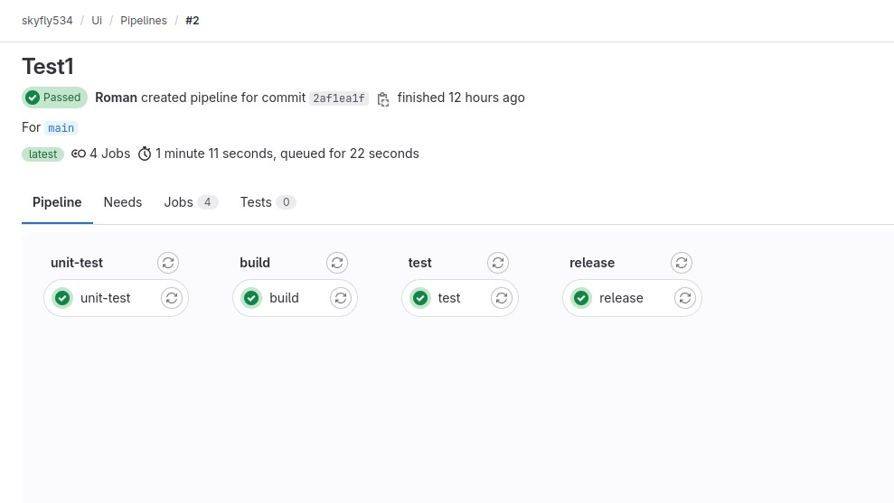
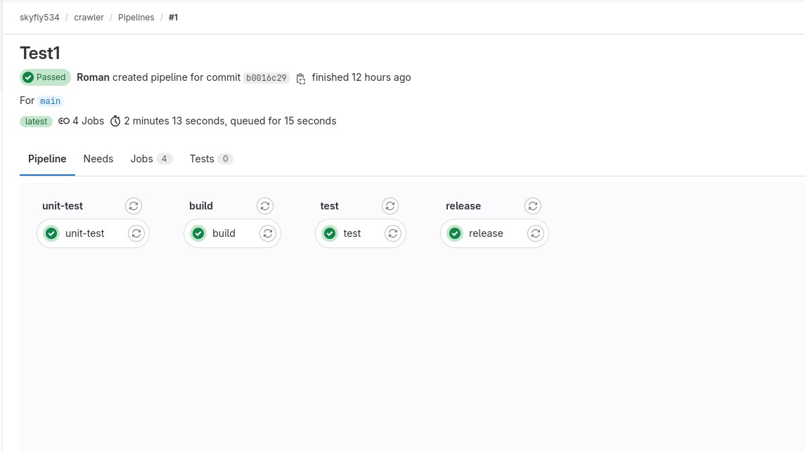
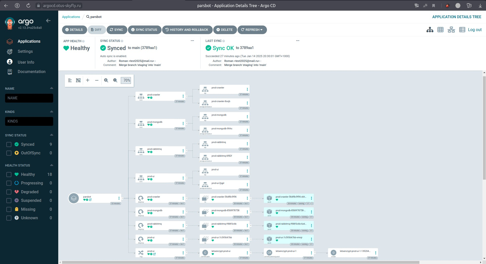
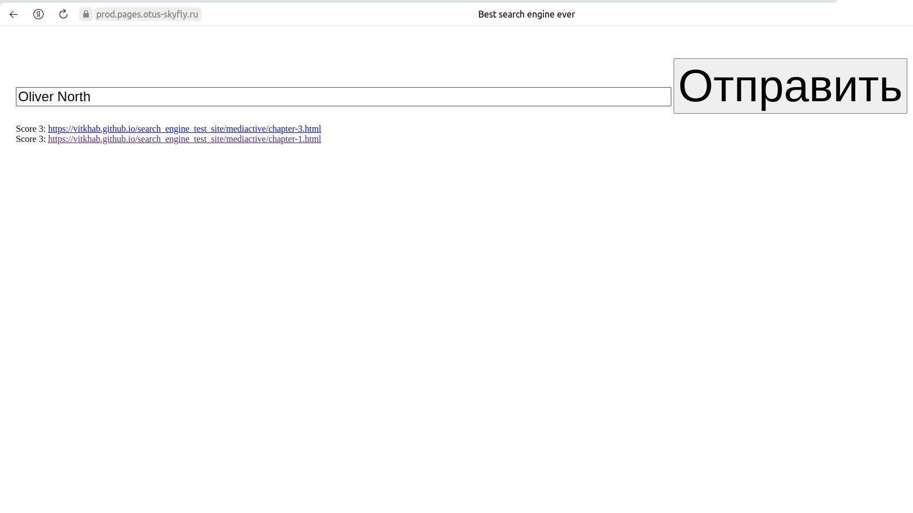
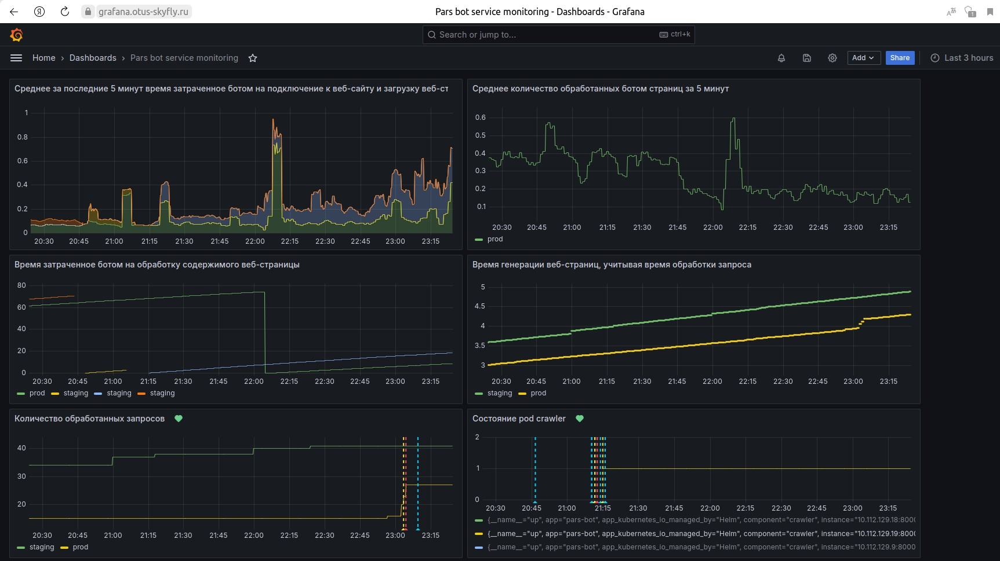
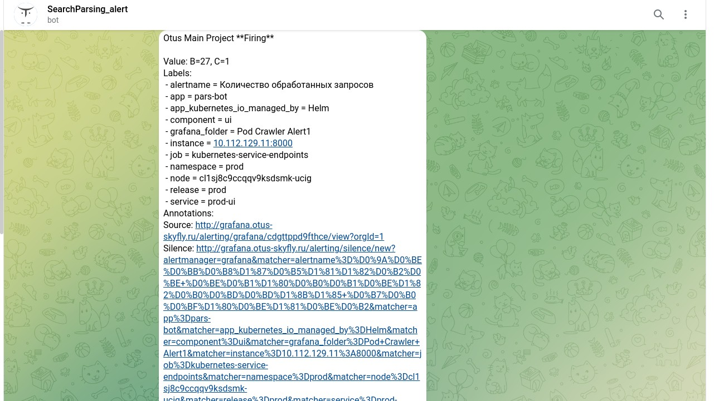

# Создание процесса непрерывной поставки для приложения с применением практик CI/CD, GitOps и IaC на базе Kubernetes, развернутого на ресурсах облачной платформы, с быстрой обратной связью.

### Содержание
1. [Описание микросервисного приложения](#описание-микросервисного-приложения)
2. [Требования](#требования)
3. [Общая реализация](#общая-реализация)
4. [Структура репозиториев и построение CI/CD](#структура-репозиториев-и-построение-cicd)
5. [Развёртывание приложения (staging) через GitLab Agent](#развёртывание-приложения-staging-через-gitlab-agent)
6. [Развёртывание в production через Argo CD](#развёртывание-в-production-через-argo-cd)
7. [Сборка, хранение Docker-образов и управление доступом](#сборка-хранение-docker-образов-и-управление-доступом)
8. [Установка и использование Cert-manager](#установка-и-использование-cert-manager)
9. [Система мониторинга и логирования](#система-мониторинга-и-логирования)
10. [Установка external-dns](#установка-external-dns)
11. [Скрипты автоматизации и порядок запуска](#скрипты-автоматизации-и-порядок-запуска)
12. [Заключение](#заключение)

---

## Описание микросервисного приложения

Приложение представляет собой систему для парсинга веб-страниц (бот) и отображения результатов (веб-интерфейс):

- **mongodb** – база данных;
- **RabbitMQ** – брокер сообщений;
- **[Search Engine Crawler](https://github.com/express42/search_engine_crawler)** – бот (парсер);
- **[Search Engine UI](https://github.com/express42/search_engine_ui?tab=readme-ov-file#search-engine-ui)** – веб-интерфейс для отображения данных, полученных ботом;
- **[Пример сайта для парсинга](https://vitkhab.github.io/search_engine_test_site/)** .

Схематически взаимодействие сервисов выглядит так:

```
  [crawler] ---> [mongodb] <---- [ui] 
       |          |
       v          v
     RabbitMQ   (logs, metrics, etc.)
```

### Особенности:
- `crawler` обходит заданный сайт по ссылкам и складывает результаты в `mongodb`.
- `ui` показывает результаты (найденные страницы, тексты).
- `RabbitMQ` может использоваться для очередей, если нужно организовать распределённые задачи и балансировку по нескольким воркерам.
- Оба сервиса отдают метрики для Prometheus (и логи).

---

## Требования

1. **Инфраструктура в Yandex Cloud**:  
   - Два кластера Kubernetes (один для GitLab, второй для приложения pars-bot).

2. **CI/CD**:
   - GitLab развёрнут в кластере `skyfly535`;
   - На кластере `pars-bot` приложение и инструменты (cert-manager, monitoring, external-dns и т.д.);
   - Сборка Docker-образов в GitLab, хранение в GitLab Container Registry;
   - Быстрая обратная связь (мониторинг, логи, оповещения).

3. **IaC (Infrastructure as Code)**:
   - Terraform для управления ресурсами в Yandex Cloud;
   - Helm Charts для деплоя микросервисов;
   - Argo CD (GitOps) для Production-окружения.

4. **Документация**:
   - Описание проекта, архитектуры и порядок запуска.

---

## Общая реализация

1. **Два Kubernetes-кластера** на основе Terraform:
   - `skyfly535`: Разворачивается GitLab (CI/CD инфраструктура).
   - `pars-bot`: Само приложение (crawler, ui, mongodb, RabbitMQ), мониторинг, cert-manager, внешние DNS-записи (external-dns) и т.п.

2. **GitLab Helm-чарт**:
   - Установка производится по инструкции из Helm-чарта `gitlab/gitlab` с корректировкой `values.yaml` (изменена редакция на `ce`, добавлены настройки `domain`, `externalIP`, `certmanager-issuer`, etc.).

3. **В кластере `pars-bot`**:
   - Устанавливается **Ingress-NGINX** контроллер;
   - Подключён GitLab Agent (для деплоя staging) — манифест `./kubernetes/parsing/Charts.gitlab/agents/pars-agent/config.yaml`;
   - Установлен **cert-manager** (через отдельный проект `cert-manager`) и настроен `ClusterIssuer` для выдачи TLS-сертификатов от Let's Encrypt (для версий приложения в окружениях `staging`,`prod` и для web интерфейса `ArgoCD`);
   - Установлен **external-dns** для автоматического управления DNS-записями в Yandex Cloud.

4. **Пайплайны**:
   - `crawler`, `ui` — собирают и пушат образы в Registry, публикуют тэг `latest` и версия из файла `VERSION`;
   - `pars-bot` — собирает Helm Charts и манифесты, потом:
     - **staging**-деплой через GitLab Agent из ветки `staging`;
     - **production**-деплой через Argo CD из ветки `main`.

5. **Мониторинг**:
   - `monitoring` проект содержит Helm-chart, который деплоит Loki Stack (для логов) и Grafana + Prometheus для метрик.  
   - Метрики crawler и ui отдаются по `:8000/metrics`.  
   - Алерты настроены на Telegram-канал.

---

## Структура репозиториев и построение CI/CD

- **Приватная группа `skyfly534`**, в ней проекты:
  1. **ui**  
     - Исходный код фронтенда, Dockerfile, `.gitlab-ci.yml` для сборки и пуша образа.
     - `.gitlab-ci.yml` для автоматизации:
        - `unit-test` - тестирование и генерация отчета о покрытии кода тестами;
        - `build` - сборка образа и размещение в Container Registry с тэгом ${CI_COMMIT_SHA};
        - `test` - шаг для тестирования образа;
        - `release` - публикация в Container Registry нашего GitLab образа микросервиса с тэгами latest и версией, взятой из файла VERSION. 
  
  

  2. **crawler**  
     - Исходный код парсера, Dockerfile, `.gitlab-ci.yml` для сборки и пуша образа.
     - `.gitlab-ci.yml` для автоматизации:
        - `unit-test` - тестирование и генерация отчета о покрытии кода тестами;
        - `build` - сборка образа и размещение в Container Registry с тэгом ${CI_COMMIT_SHA};
        - `test` - шаг для тестирования образа;
        - `release` - публикация в Container Registry нашего GitLab образа микросервиса с тэгами latest и версией, взятой из файла VERSION.

  

  3. **pars-bot**  
     - Основной Helm-чарт `pars-bot/`, а также Charts для mongodb, rabbitmq, UI, crawler.  
     - `.gitlab-ci.yml` для автоматизации:
       - `test` (общие проверки), 
       - `staging` (автоматический деплой через GitLab Agent при пуше в ветку `staging`),
       - `prod` (деплой в прод при помощи Argo CD из ветки `main`, запуск вручную / после merge).  
     - Внутри `.gitlab/agents/pars-agent/config.yaml` — настройки GitLab Agent.  
  4. **cert-manager**  
     - Манифесты Helm,  для установки cert-manager в кластер `pars-bot`.  
  5. **monitoring**  
     - Helm-чарты для развертывания Loki, Prometheus, Grafana;  
     - Настройка дашбордов, правила алертинга.

- **Группа `skyfly534`** требует **Access Token** для доступа к коду.  
  - У **каждого** пайплайна (crawler/ui/pars-bot) могут быть свои переменные (CI_REGISTRY_PASSWORD / `PRIVATE-TOKEN` и т.п.), заданные в GitLab → Settings → CI/CD → Variables (с отключённым «Expand variable reference», чтобы `$` в токене не ломался).
  - В свойствах группы в пункте `CI/CD`,необходимо добавить переменнаю `KUBE_CONTEXT` (skyfly534/pars-bot:pars-agent) с именем контекста Kubernetes кластера для подключения из GitLab Runner'ов (определена для группы проектов skyfly534).

---

## Развёртывание приложения (staging) через GitLab Agent

1. **Ветка `staging`** в репо `pars-bot`:  
   - При пуше изменений в ветку `staging` активируется пайплайн → стадия `staging`.  
2. **GitLab Agent** (проект `pars-bot` → Infrastructure → Kubernetes clusters):  
   - Config-файл `.gitlab/agents/pars-agent/config.yaml` разрешает деплой в кластер `pars-bot`. 
```
ci_access:
  groups:
    - id: skyfly534
```
  Агент авторизуется для проектов всей группы.  
   - В пайплайне используется команда `helm upgrade --install ... --namespace=staging ...` (или аналог), с указанием нужных параметров (host и т.д.).  

В результате приложение будет доступно по адресу **`https://staging.pages.otus-skyfly.ru/`** (если всё настроено на выдачу TLS-сертификата Let's Encrypt для домена `staging.pages.otus-skyfly.ru`).

---

## Развёртывание в production через Argo CD

1. **Ветка `main`** в репо `pars-bot`:  
  - Argo CD автоматически подтягивает изменения из ветки `main` и применяет их в кластере без дополнительных действий (т.е. при каждом новом коммите/merge в `main`):

```yaml
apiVersion: argoproj.io/v1alpha1
kind: Application
metadata:
  name: parsbot
  namespace: argocd
spec:
  destination:
    namespace: parsbot
    server: "https://kubernetes.default.svc"
  source:
    repoURL: "https://gitlab.otus-skyfly.ru/skyfly534/pars-bot.git"
    targetRevision: main      # Отслеживаем ветку main
    path: pars-bot
    helm:
      releaseName: prod
  project: otus
  syncPolicy:
    automated:
      prune: true        # Удалять «лишние» ресурсы, не описанные в гите
      selfHeal: true     # Автоматически восстанавливать состояние, если оно изменилось вручную
    syncOptions:
      - CreateNamespace=true  # Создавать namespace при отсутствии
  project: otus
```
   - Argo CD синхронизирует состояние в кластере (namespace `parsbot`).  

  

2. **Хост prod** настраивается в `values.yaml`/`values-prod.yaml` или через `--set`, и в итоговом Ingress получается **`https://prod.pages.otus-skyfly.ru/`**.  

  
---

## Сборка, хранение Docker-образов и управление доступом

- **GitLab Container Registry**:  
  - При сборке сервисов `crawler` и `ui` создаётся образ `registry.otus-skyfly.ru/skyfly534/<имя_проекта>`.  
  - Пайплайн добавляет тэги `:latest` и `:<версия_из_VERSION>`.

- **Аутентификация**:  
  - Для пуша/pull образов используется Deploy Token или Access Token (с `write_registry`).  
  - Для чтения raw-файлов (например, `VERSION`) — другой токен с правами `read_repository`.

---

## Установка и использование Cert-manager

- **Проект `cert-manager`** в GitLab:
  - В пайплайне есть стадии `deploy` и `apply`, которые ставят Helm-чарт cert-manager и накатывают `ClusterIssuer`.  
- **ClusterIssuer**:
  - В зависимости от окружения используется `acme-staging-v02.api.letsencrypt.org/directory` (staging) или `acme-v02.api.letsencrypt.org/directory` (prod).  
- Все входящие HTTP-запросы идут через Ingress, который запрашивает у cert-manager сертификаты.

---

## Система мониторинга и логирования

- **Проект `monitoring`**:
  - Разворачивает Loki Stack, Prometheus, Grafana.  
  - Метрики сервисов `crawler` и `ui` собираются Prometheus через аннотации:
    ```
    prometheus.io/scrape: "true"
    prometheus.io/path: "/metrics"
    prometheus.io/port: "8000"
    ```
  - Grafana поднимается на `https://grafana.otus-skyfly.ru/`.

  

  - В Loki стекаются логи (stdout).  
  - Алерты отправляются в Telegram.

  

---

## Установка external-dns

- **external-dns** установлен в кластере `pars-bot`:
  - Через отдельный Helm-чарт `externaldns/` (лежит в локальном репо или в GitLab).  
  - Параметры `folder_id` и `auth_key` (JSON ключ Yandex) пробрасываются в Values.  
  - external-dns автоматически добавляет/удаляет DNS-записи для Ingress-ресурсов (например, `*.pages.otus-skyfly.ru`).

---

## Скрипты автоматизации и порядок запуска

В репозитории есть несколько скриптов:

1. **Установка кластера skyfly535 и GitLab** 
`./installGit.sh`:

```bash
   #!/bin/bash

  # Проверка наличия YC CLI
  if ! command -v yc &> /dev/null; then
    echo "YC CLI not found. Please install and configure it."
    exit 1
  fi

  # Установка кластера Kubernetes в Yandex Cloud
  cd terraform_YC_k8s || exit 1
  echo "=== Установка кластера Kubernetes ==="
  terraform apply -auto-approve || exit 1

  # Регистрация кластер локально
  echo "=== Регистррация кластер локально ==="
  yc managed-kubernetes cluster get-credentials skyfly535 --external || exit 1

  # Установка Helm чарта GitLab
  cd .. || exit 1
  echo "=== Установка Helm чарта GitLab ==="
  helm install gitlab ./gitlab || exit 1

  # Вывод root пароля для GitLab
  echo "=== root пароля для GitLab ==="
  kubectl get secret gitlab-gitlab-initial-root-password -ojsonpath='{.data.password}' | base64 --decode ; echo
```

2. **Установка кластера pars-bot, Ingress-NGINX и external-dns**  
`./kubernetes-gitops/install.sh`:

```bash
# Установка кластера Kubernetes удовлетваряющего условиям ДЗ в Yandex Cloud
#!/bin/bash

# Название клиента (передается как аргумент к скрипту)
folder_id=$1
auth_key=$2

# Проверка аргументов
if [ -z "$1" ] || [ -z "$2" ]; then
  echo "Usage: $0 <folder_id> <auth_key_path>"
  exit 1
fi

# Проверка наличия auth_key
if [ ! -f "$auth_key" ]; then
  echo "Auth key file $auth_key not found."
  exit 1
fi

# Проверка наличия YC CLI
if ! command -v yc &> /dev/null; then
  echo "YC CLI not found. Please install and configure it."
  exit 1
fi

# Установка кластера Kubernetes в Yandex Cloud
cd terraform_YC_k8s || exit 1
echo "=== Установка кластера Kubernetes ==="
terraform apply -auto-approve || exit 1

# Регистррация кластер локально
echo "=== Регистррация кластер локально ==="
yc managed-kubernetes cluster get-credentials pars-bot --external

# Установка externaldns
cd .. || exit 1
echo "=== Установка externaldns ==="
helm install \
  --namespace externaldns \
  --create-namespace \
  --set config.folder_id="$folder_id" \
  --set-file config.auth.json="$auth_key" \
  externaldns ./externaldns/ || exit 1

# Установка Ingress-NGINX
echo "=== Установка Ingress-NGINX ==="
helm upgrade --install ingress-nginx ingress-nginx \
  --repo https://kubernetes.github.io/ingress-nginx \
  --namespace ingress-nginx --create-namespace
echo "Ingress-NGINX успешно установлен."
```

Запуск скрипта параметризирован

```bash
bash install.sh aaaaaa111111bbbbb222 /path/to/key.json
```  
где:
 - `aaaaaa111111bbbbb222` - идентификатор каталога с DNS-зоной YC
 - `/path/to/key.json` - путь к файлу с авторизованным ключом сервисного аккаунта

3. **Установка ArgoCD,созание проекта Otus и запуск приложения pars-bot в ArgoCD** и автоматизация 
`./kubernetes-gitops/install_pars.sh`:

```bash
#!/bin/bash

# Скрипт для установки ArgoCD, настройки проекта и создания секретов

set -e  # Прекращает выполнение при любой ошибке

# Проверка, что переданы все необходимые аргументы
if [ -z "$1" ] || [ -z "$2" ]; then
  echo "Usage: $0 <git_user> <git_token>"
  exit 1
fi

git_user=$1
git_token=$2

# Установка Helm чарта ArgoCD
echo "=== Установка ArgoCD ==="
cd argocd
kubectl apply -f nsargocd.yaml
helmfile apply
cd ..
echo "ArgoCD успешно установлен."

# Создание проекта Otus в ArgoCD
echo "=== Создание проекта Otus в ArgoCD ==="
kubectl apply -f appproject.yaml
echo "Проект Otus успешно создан."

# Создание секрета для доступа к репозиторию GitLab
echo "=== Создание секрета для доступа к репозиторию GitLab ==="
cat <<EOF > repo-parsbot-secret.yaml
apiVersion: v1
kind: Secret
metadata:
  name: repo-parsbot
  namespace: argocd
  labels:
    argocd.argoproj.io/secret-type: repository
type: Opaque
stringData:
  name: pars-bot
  url: https://gitlab.otus-skyfly.ru/skyfly534/pars-bot.git
  username: $git_user
  password: "$git_token"
EOF

kubectl apply -f repo-parsbot-secret.yaml
rm -f repo-parsbot-secret.yaml  # Удаление временного файла
echo "Секрет repo-parsbot успешно создан."
echo "=== Создание секретов Docker Registry ==="

# Создает namespace parsbot, если его еще нет 
kubectl create namespace parsbot || true  

# Создание Docker Registry секрета
echo "=== Создание Docker Registry секрета GitLab ==="
kubectl create secret docker-registry regcred \
  --docker-server=registry.otus-skyfly.ru \
  --docker-username=gitlab+deploy-token-1 \
  --docker-password=$git_token \
  --docker-email=otus2024@mail.ru \
  --namespace=parsbot
echo "Секреты regcred успешно созданы."

# Запуск приложения в ArgoCD
echo "=== Запуск приложения в ArgoCD ==="
kubectl apply -f parsbot-application.yaml
echo "Приложение успешно запущено."

# Вывод пароля Admin ArgoCD для входа ==="
echo "=== Пароль Admin ArgoCD для входа ==="
kubectl -n argocd get secret argocd-initial-admin-secret -o jsonpath="{.data.password}" | base64 -d

echo "=== Установка завершена успешно ==="
```

Запуск скрипта параметризирован

```bash
bash install_pars.sh User glpat-AAAAbbbbCCCCddddd
```  
где:
 - `User` - username GitLab
 - `glpat-AAAAbbbbCCCCddddd` - AccessToken с правами `read_repository` и `read_registry`

## Примерный **порядок развёртывания**:

1. **Установить кластер skyfly535 и GitLab**:
   ```bash
   bash installGit.sh
   ```
2. **Создать группу skyfly534 (приватную) в GitLab**, добавить нужных пользователей, настроить Access Tokens.
3. **Установить кластер pars-bot, Ingress-NGINX и external-dns**:
   ```bash
   bash ./kubernetes-gitops/install.sh aaaaaa111111bbbbb222 /path/to/key.json
   ```
4. **(Опционально) Установить cert-manager** (через проект `cert-manager`) и создать ClusterIssuer (staging/prod).
5. **Установить ArgoCD,созать проект Otus и запутить приложение pars-bot в ArgoCD**:
   ```bash
   bash ./kubernetes-gitops/install_pars.sh User glpat-AAAAbbbbCCCCddddd
   ```
6. **Развернуть monitoring** (проект `monitoring`).
7. **Развернуть приложение**:
   - **staging**: пушим в ветку `staging` → GitLab Agent деплоит в namespace `staging`.
   - **production**: мёржим `staging` → `main`, и Argo CD синхронизирует прод.

---

## Заключение

В результате выполненных шагов мы получаем:

- **Полностью автоматизированную инфраструктуру** (Terraform, Helm, GitLab CI, Argo CD);
- **Два окружения**: Staging (GitLab Agent), Production (Argo CD);
- **Мониторинг и логирование** (Prometheus, Grafana, Loki);
- **Автоматическую выдачу сертификатов** Let’s Encrypt (cert-manager) и **автоматические DNS-записи** (external-dns).

Приложение доступно по адресам:

- Staging: `https://staging.pages.otus-skyfly.ru/`

- Production: `https://prod.pages.otus-skyfly.ru/`

ArgoCD: `https://argocd.otus-skyfly.ru` (Web интерфейс)

Grafana: `https://grafana.otus-skyfly.ru/` (для просмотра метрик, логов и алертов).

---

> **Важно**: При работе с приватной группой GitLab (**skyfly534**) нужно корректно настроить **Access Tokens** (CI_REGISTRY_PASSWORD, PERSONAL_ACCESS_TOKEN, Deploy Tokens). Токены должны иметь права `read_repository`, `write_registry` и т.д. в зависимости от задачи. 
